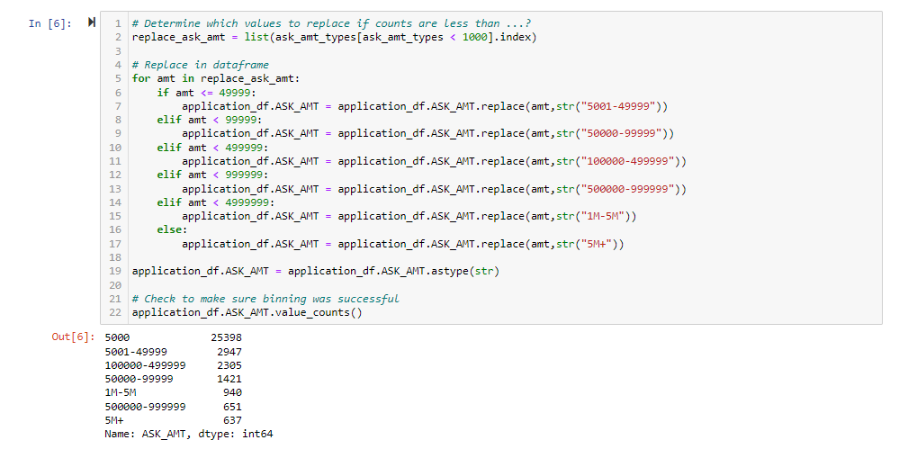
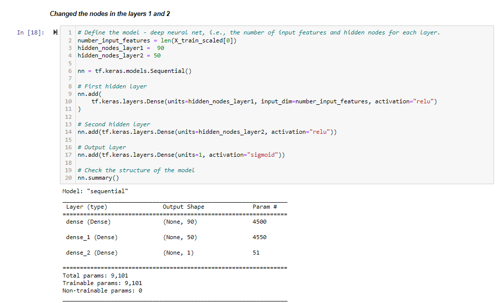

# 19-Neural_Network_Charity_Analysis

## Overview of the analysis: 

The Alphabet Soup’s business team, has a CSV containing more than 34,000 organizations that have received funding from Alphabet Soup over the years. Within this dataset are a number of columns that capture metadata about each organization, such as the following:

1. EIN and NAME—Identification columns
2. APPLICATION_TYPE—Alphabet Soup application type
3. AFFILIATION—Affiliated sector of industry
4. CLASSIFICATION—Government organization classification
5. USE_CASE—Use case for funding
6. ORGANIZATION—Organization type
7. STATUS—Active status
8. INCOME_AMT—Income classification
9. SPECIAL_CONSIDERATIONS—Special consideration for application
10. ASK_AMT—Funding amount requested
11. IS_SUCCESSFUL—Was the money used effectively

Following are the deliveables required:

1. Deliverable 1: Preprocessing Data for a Neural Network Model
2. Deliverable 2: Compile, Train, and Evaluate the Model
3. Deliverable 3: Optimize the Model
4. Deliverable 4: A Written Report on the Neural Network Model

## Results: 

## Data Preprocessing

Processed the Application_type and classification for the model.

For Optimization of the model - processed the ask_amt in different bins

## Variable(s) that are considered the target(s) for the model

The column IS_SUCCESSFUL is considered as the target for our deep learning neural network

## Variable(s) that are considered to be the features for the  model

The following columns APPLICATION_TYPE, AFFILIATION, CLASSIFICATION, USE_CASE, ORGANIZATION, STATUS, INCOME_AMT, SPECIAL_CONSIDERATIONS, ASK_AMT are the features for our model.

## Variable(s) that are considered neither targets nor features, and should be removed from the input data

The columns EIN and NAME are to be removed from the input data.

## Compiling, Training, and Evaluating the Model

## Number of neurons, layers, and activation functions that were selected for the neural network model, and why?

The deep learning Neural Networks has:
1. number_input_features = len(X_train_scaled[0]) - which is about 43 as our features are 43
2. hidden_nodes_layer1 =  80
3. hidden_nodes_layer2 = 30
4. Activation function as ReLu
5. Output binary classification as Sigmoid
6. Compilation:  the optimizer is adam, loss function is binary_crossentropy with the metrics being accuracy

## Were you able to achieve the target model performance?

## Model Performance Optimization?

1. Optimization 1:
Changed Bins for Ask_Amt:

2. Optimization 2:
Added additional nodes for the layers

3. Optimization 3: 
Added extra hidden layer and changed the activation function

4. Optimization 4: 
Changed the activation function

## Summary

Summarize the overall results of the deep learning model. Include a recommendation for how a different model could solve this classification problem, and explain your recommendation.
