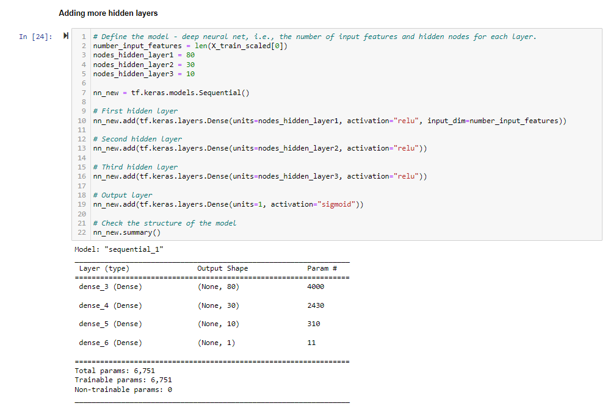

# 19-Neural_Network_Charity_Analysis

## Overview of the analysis: Explain the purpose of this analysis.

The Alphabet Soup’s business team, has a CSV containing more than 34,000 organizations that have received funding from Alphabet Soup over the years. Within this dataset are a number of columns that capture metadata about each organization, such as the following:

1. EIN and NAME—Identification columns
2. APPLICATION_TYPE—Alphabet Soup application type
3. AFFILIATION—Affiliated sector of industry
4. CLASSIFICATION—Government organization classification
5. USE_CASE—Use case for funding
6. ORGANIZATION—Organization type
7. STATUS—Active status
8. INCOME_AMT—Income classification
9. SPECIAL_CONSIDERATIONS—Special consideration for application
10. ASK_AMT—Funding amount requested
11. IS_SUCCESSFUL—Was the money used effectively

Following are the deliveables required:

Deliverable 1: Preprocessing Data for a Neural Network Model
Deliverable 2: Compile, Train, and Evaluate the Model
Deliverable 3: Optimize the Model
Deliverable 4: A Written Report on the Neural Network Model

## Results: Using bulleted lists and images to support your answers, address the following questions.

## Data Preprocessing

### Variable(s) that are considered the target(s) for the model

The column IS_SUCCESSFUL contains binary data refering to weither or not the charity donation was used effectively. This variable is then considered as the target for our deep learning neural network

### Variable(s) that are considered to be the features for the  model

he following columns APPLICATION_TYPE, AFFILIATION, CLASSIFICATION, USE_CASE, ORGANIZATION, STATUS, INCOME_AMT, SPECIAL_CONSIDERATIONS, ASK_AMT are the features for our model.

### Variable(s) that are considered neither targets nor features, and should be removed from the input data

The columns EIN and NAME are identification information and have been removed from the input data.

### Compiling, Training, and Evaluating the Model

### Number of neurons, layers, and activation functions that were selected for the neural network model, and why?

This deep-learning neural network model is made of two hidden layers with 80 and 30 neurons respectively.
The input data has 43 features.
The output layer is made of a unique neuron as it is a binary classification.
To speed up the training process, we are using the activation function ReLU for the hidden layers. As our output is a binary classification, Sigmoid is used on the output layer.
For the compilation, the optimizer is adam and the loss function is binary_crossentropy with the metrics being accuracy

### Were you able to achieve the target model performance?

### Model Performance Optimization?

1. Optimization 1:
Changed Bins for Ask_Amt:

2. Optimization 2:
Added additional nodes for the layers

3. Optimization 3: 
Added extra hidden layer and changed the activation function

## Summary

Summarize the overall results of the deep learning model. Include a recommendation for how a different model could solve this classification problem, and explain your recommendation.
